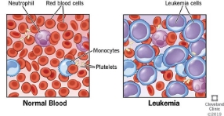
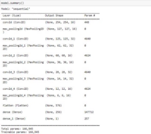
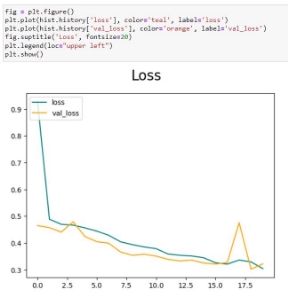
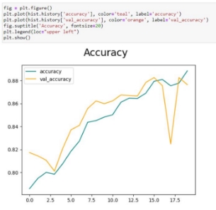
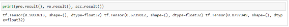

# Leukaemia_cell_classification_NATHANPHILIPB

**Classification of Leukaemia Cells using CNN**

**Nathan Philip Bulla**, Vellore Institute of Technology - Andhra Pradesh, Amaravati, Andhra Pradesh, India

Leukaemia is a cancer of the blood-forming tissues of the body, and is the most common paediatric cancer.

The most common method for detecting leukaemia is by observing blood samples: abnormal levels of blood cells or platelets may suggest some form of leukaemia, and in certain cases, leukaemia cells may also be found in the blood sample, confirming presence of the disease; But using CNN or similar Deep Learning techniques may allow us to design an Automatic method for a diagnosis that requires lesser human discernment.

1. **Introduction**

This paper aims at exploring a CNN model to accurately classify Acute Lymphocytic Leukaemia (ALL) cells and so help in diagnosing early stages of the disease.

Leukaemia is the most common form of paediatric cancers amounting to almost 40% of paediatric cancer cases [1][4]; Acute Lymphocytic Leukaemia amounting to 75% of childhood leukemias.

Paediatric or childhood cancers differ from adult cancers in the ways in which they affect the patient and the ways they are to be treated.

The common test to diagnose ALL is by blood tests to conduct Complete Blood Count (CBC) to measure the counts of all the blood cells to detect any abnormalities.

In case abnormalities are found, they would prepare for a Bone Marrow Aspiration and Bone Marrow Biopsy [6].

Fig.1 Image showing the possible differences between leukemic and normal blood samples.[9]

The test results would come after a thorough analysis of the samples by an experienced pathologist [6].

Pathologists and operators are not free from human error, so there had been a need to develop an automatic and consistent system to give reliable outputs aiding in the diagnosis of the disease. Which has been accomplished by using CNN [7][8].

2. **Literature Survey**

Many machine learning methods have been used to attempt to diagnose leukaemia [3], but CNN is shown to be one of the more efficient methods out of them [8].

One of the methods used by many researchers working on implementing CNN to diagnose ALL was Data Augmentation, which was used as an efficient and smart way to increase the accuracy of the model using only limited training data, which is crucial as it is difficult to acquire medical image data due to privacy concerns.

|Tulasi Gayatri Devi et al., 2023 [11]|Detect and classify ALL|Private Dataset|GBHSV-Leuk Algorithm (Proposed)|
Accuracy 96.30% (On private dataset)

Accuracy 95.41% (on public dataset)
|
| :- | :- | - | :- | :- |
|Arjun Abhishek et al., 2022 [10]|Classification of ALL|Private dataset + ALL-IDB|Fine tuned VGG16 and SVM(DenseNet12 1 along with SVM)|
Accuracy 96% (fine tuned VGG16)

Accuracy 95% (SVM)
|
|Thanh Tran et al., 2018 [8]|Classification of ALL|ALL-IDB1 (Augmented)|CNN|Accuracy 96.6%|
|Shafique and Tehsin, 2020 [12]|Detection and classification of ALL|ALL-IDB1 and ALL-IDB2|CNN (AlexNet)|Accuracy 99.50% (ALL detection) Accuracy 96.06% (ALL subtype classification)|

3. **Methodology**

The images were acquired from a public dataset [2] from CNMC. Microscopic images of cells were segmented and used to train a CNN model to classify the cells indicating Acute Lymphocytic Leukaemia, against normal cells.

The implemented CNN model has three types of layers: Convolution layers, Pooling layers, and fully-connected layers.

The initial images of the isolated cells may have had some staining noise, but that would have been largely rectified in the acquisition of the segmented image data.

The images are segmented on acquisition [2]. They were resized to 256x256 for the experiment.

Convolution can be expressed mathematically as follows- consider an N×N neuron layer as input, and a filter of size m×m; will give an output of size (N-m+1)×(N-m+1).

−1 −1

lij = ∑ ∑ ωabyl-1(i+a)(j+b)

=0 =0

This is the output without nonlinearity. The nonlinearity can then be applied to the unit xℓij

ylij = σ(xlij)

The other layer used is the Max Pooling layer.

Max pooling layer takes a k×k layer, and find return a single maximum value from that region. It does this across the whole N×N input layer, therefore, returning a (N/k)×(N/k) output layer.

The flatten layer is used to convert or flatten a 2-Dimensional array into a long 1-Dimensional linear vector that is continuous.

The dense layer, also known as the deeply-connected layer is called so as it can be seen that each neuron in the dense layer is deeply connected to every neuron of the preceding layer.

The model used consists of 13 layers:

1 convolution layer with input shape 256 x 256 x 3 with 16 filters and kernel size 3x3 without any padding, and with ReLU activation. Followed by a max pooling layer.

Fig.2

Alternating blocks of convolution and max pooling layers are repeated, ending in two dense/fully-connected layers.

All but the final dense layer using ReLU activation, the final layer using sigmoidal activation.

L2 regularisation was used on the first dense layer.

4. **Results**

The model ran for 20 epochs, and gave an 88% accuracy score.

It gave 90.33% precision, and 67.39% recall.

There is much more room for optimization and ways to reorganise the architecture to better fit the dataset and improve accuracy.

Fig.3 Loss curve

Fig.4 Accuracy curve

5. **Conclusion**

The model can be improved further, but with the right techniques, it can become an invaluable tool in the diagnosis of ALL.

This may be done by using image augmentation or by increasing the scale of the architecture of the model, in the future.

The development and involvement of Deep Learning methods in the wider fields of medicine and technology is expanding day by day, and numerous outstanding feats of deep learning are revealed to us each day.

The use of CNN has proven to be successful for the detection and diagnosis of Acute Lymphocytic Leukaemia [7][8], but is still yet to be

6. **References**
1. Joseph Wiemels, Perspectives on the causes of childhood leukaemia, Chemico-Biological Interactions, Volume 196, Issue 3, 2012, Pages 59-67, ISSN 0009-2797, https://doi.org/10.1016/j.cbi.2012.01.07.
1. Gupta, A., & Gupta, R. (2019). ALL Challenge dataset of ISBI 2019 [Data set]. The Cancer Imaging Archive. <https://doi.org/10.7937/tcia.2019.dc64i46r>
1. Mustafa Ghaderzadeh, Farkhondeh Asadi, Azamossadat Hosseini, Davood Bashash, Hassan Abolghasemi, Arash Roshanpour. (2021). "Machine Learning in Detection and Classification of Leukemia Using Smear Blood Images: A Systematic Review", Scientific Programming, vol. 2021, Article ID 9933481, 14 pages. <https://doi.org/10.1155/2021/9933481>
1. Kaatsch, Peter. "Epidemiology of childhood cancer." Cancer treatment reviews 36.4 (2010): 277-285.
1. E. A. Mohammed, M. M. A. Mohamed, C. Naugler, and B. H. Far, “Chronic lymphocytic leukemia cell segmentation from microscopic blood images using watershed algorithm and optimal thresholding,” in Proceedings of the 2013 26th IEEE Canadian Conference on Electrical and Computer Engineering (CCECE), Regina, Canada, 2013.
1. Kaur, M., Singh Rana, A. P., Kapoor, S., & Puri, A. (2014). Diagnostic value of bone marrow aspiration and biopsy in routine hematology practice. Journal of clinical and diagnostic research : JCDR, 8(8), FC13–FC16. <https://doi.org/10.7860/JCDR/2014/9823.4760>
1. Priyanka Rastogi, Kavita Khanna, Vijendra Singh. (2022). LeuFeatx: Deep learning–based feature extractor for the diagnosis of acute leukemia from microscopic images of peripheral blood smear. Computers in Biology and Medicine, Volume 142, 105236, ISSN 0010-4825, <https://doi.org/10.1016/j.compbiomed.2022.105236>.
8. Tran, T. & Vununu, Caleb & Atoev, Sukhrob & Lee, Suk-Hwan & Kwon, Ki-Ryong. (2018). Leukemia Blood Cell Image Classification Using Convolutional Neural Network. International journal of computer theory and engineering. 10. 54-58. 10.7763/IJCTE.2018.V10.1198.
8. Leukemia: Symptoms, Signs, Causes, Types & Treatment. (n.d.). Leukemia: Symptoms, Signs, Causes, Types & Treatment. Retrieved March 23, 2023, from <https://my.clevelandclinic.org/health/diseases/4365-leukemia>

   [10]Arjun Abhishek, Rajib Kumar Jha, Ruchi Sinha, Kamlesh Jha,

   Automated classification of acute leukemia on a heterogeneous dataset using machine learning and deep learning techniques, Biomedical Signal Processing and Control, Volume 72, Part B, 2022, 103341, ISSN 1746-8094,

   <https://doi.org/10.1016/j.bspc.2021.103341>

11. Devi TG, Patil N, Rai S, Philipose CS. Gaussian Blurring Technique for Detecting and Classifying Acute Lymphoblastic Leukemia Cancer Cells from Microscopic Biopsy Images. Life. 2023; 13(2):348. <https://doi.org/10.3390/life13020348>
11. S. Shafique and S. Tehsin, “Acute lymphoblastic leukemia detection and classification of its subtypes using pretrained deep convolutional neural networks,” Technology in Cancer Research

    & Treatment, vol. 17, 2018.
